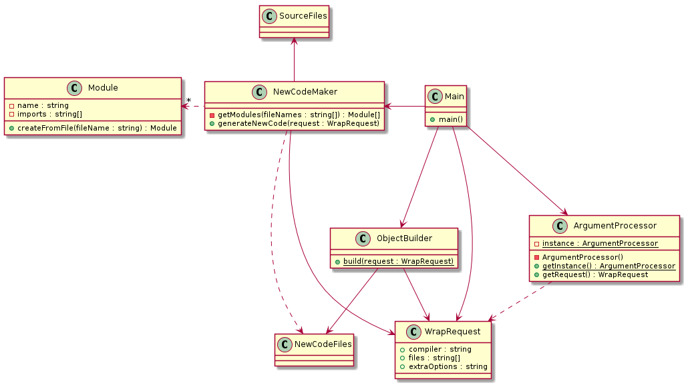

# Dylan's C Wrapper

## Description

A minimal compiler wrapper for C that implements a module system

## Use

`dcw <CC> <source> <source> <source> ... [ -cf <options> ]`

The 'options' would be aditional C compiler options in case of 3rd party headers and such. Example:

`dcw gcc hello.c world.c -cf -Ithirdpartyheadersthataren'tmodules -Dextra-defs`

## Design

The gist of what I'm doing is captured in the UML below:

